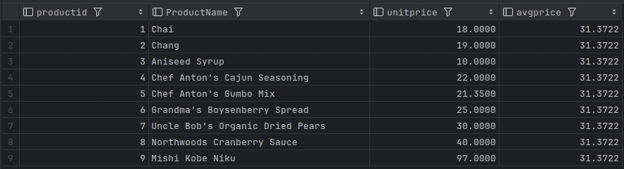
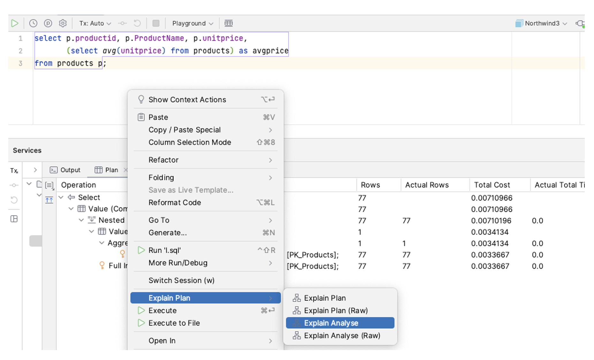
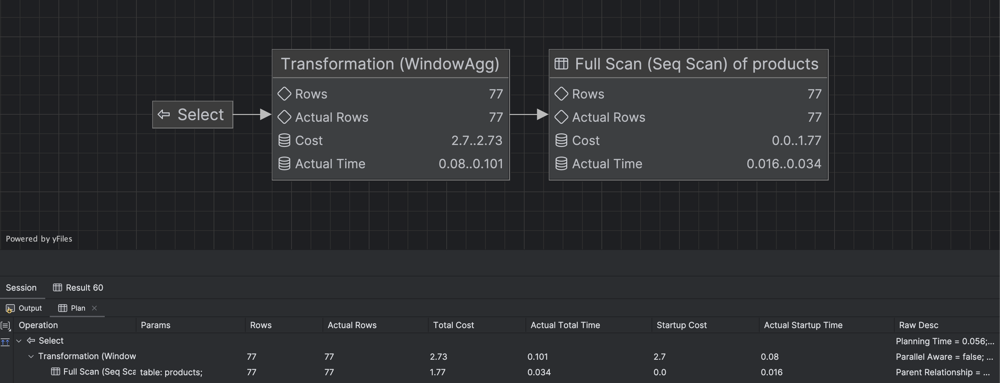

## SQL - Funkcje okna (Window functions) <br> Lab 1

---

**Imiona i nazwiska: Michał Skałka i Jakub Płowiec**

---

Celem ćwiczenia jest przygotowanie środowiska pracy, wstępne zapoznanie się z działaniem funkcji okna (window functions) w SQL, analiza wydajności zapytań i porównanie z rozwiązaniami przy wykorzystaniu "tradycyjnych" konstrukcji SQL

Swoje odpowiedzi wpisuj w miejsca oznaczone jako:

---

> Wyniki:

```sql
--  ...
```

---

Ważne/wymagane są komentarze.

Zamieść kod rozwiązania oraz zrzuty ekranu pokazujące wyniki, (dołącz kod rozwiązania w formie tekstowej/źródłowej)

Zwróć uwagę na formatowanie kodu

---

## Oprogramowanie - co jest potrzebne?

Do wykonania ćwiczenia potrzebne jest następujące oprogramowanie:

- MS SQL Server - wersja 2019, 2022
- PostgreSQL - wersja 15/16
- SQLite
- Narzędzia do komunikacji z bazą danych
  - SSMS - Microsoft SQL Managment Studio
  - DtataGrip lub DBeaver
- Przykładowa baza Northwind
  - W wersji dla każdego z wymienionych serwerów

Oprogramowanie dostępne jest na przygotowanej maszynie wirtualnej

## Dokumentacja/Literatura

- Kathi Kellenberger,  Clayton Groom, Ed Pollack, Expert T-SQL Window Functions in SQL Server 2019, Apres 2019
- Itzik Ben-Gan, T-SQL Window Functions: For Data Analysis and Beyond, Microsoft 2020

- Kilka linków do materiałów które mogą być pomocne
   - [https://learn.microsoft.com/en-us/sql/t-sql/queries/select-over-clause-transact-sql?view=sql-server-ver16](https://learn.microsoft.com/en-us/sql/t-sql/queries/select-over-clause-transact-sql?view=sql-server-ver16)

  - [https://www.sqlservertutorial.net/sql-server-window-functions/](https://www.sqlservertutorial.net/sql-server-window-functions/)
  - [https://www.sqlshack.com/use-window-functions-sql-server/](https://www.sqlshack.com/use-window-functions-sql-server/)
  - [https://www.postgresql.org/docs/current/tutorial-window.html](https://www.postgresql.org/docs/current/tutorial-window.html)
  - [https://www.postgresqltutorial.com/postgresql-window-function/](https://www.postgresqltutorial.com/postgresql-window-function/)
  - [https://www.sqlite.org/windowfunctions.html](https://www.sqlite.org/windowfunctions.html)
  - [https://www.sqlitetutorial.net/sqlite-window-functions/](https://www.sqlitetutorial.net/sqlite-window-functions/)

- Ikonki używane w graficznej prezentacji planu zapytania w SSMS opisane są tutaj:
  - [https://docs.microsoft.com/en-us/sql/relational-databases/showplan-logical-and-physical-operators-reference](https://docs.microsoft.com/en-us/sql/relational-databases/showplan-logical-and-physical-operators-reference)

## Przygotowanie

Uruchom SSMS
- Skonfiguruj połączenie z bazą Northwind na lokalnym serwerze MS SQL

Uruchom DataGrip (lub Dbeaver)

- Skonfiguruj połączenia z bazą Northwind
  - na lokalnym serwerze MS SQL
  - na lokalnym serwerze PostgreSQL
  - z lokalną bazą SQLite

---

# Zadanie 1 - obserwacja

Wykonaj i porównaj wyniki następujących poleceń.

```sql
select avg(unitprice) avgprice
from products p;

select avg(unitprice) over () as avgprice
from products p;

select categoryid, avg(unitprice) avgprice
from products p
group by categoryid

select avg(unitprice) over (partition by categoryid) as avgprice
from products p;
```

Jaka jest są podobieństwa, jakie różnice pomiędzy grupowaniem danych a działaniem funkcji okna?

---

> Wyniki:

Wszystkie z 4 zapytań operują na tabeli products, wykonując operację średniej ceny jednostkowej (unitprice) na różne sposoby:

1. Pierwsze zapytanie zwraca 1 wartość, czyli średnią całej kolumny `unitprice`


2. W drugim natomiast mozemy zaobserować działanie funkcji okna. Zwraca średnią cenę dla całej tabeli, ale zamiast jednej wartości dla całego zestawu danych, zwraca tę samą wartość w każdym wierszu


3. Grupuje produkty według unikalnych wartości `categoryid` i oblicza średnią cenę dla każdej kategorii osobno.


4. Oblicza średnią dla każdej kategorii (categoryid), ale różnica w stosunku do GROUP BY polega na tym, że każdy rekord pozostaje w tabeli, nie jest agregowany w 1 wartość. Dodatkowo w każdym wierszu pojawia się średnia cena dla kategorii, do której dany produkt należy.


```sql

```

---
# Zadanie 2 - obserwacja

Wykonaj i porównaj wyniki następujących poleceń.

```sql
--1)

select p.productid, p.ProductName, p.unitprice,  
       (select avg(unitprice) from products) as avgprice  
from products p  
where productid < 10

--2)
select p.productid, p.ProductName, p.unitprice,  
       avg(unitprice) over () as avgprice  
from products p  
where productid < 10
```


Jaka jest różnica? Czego dotyczy warunek w każdym z przypadków? Napisz polecenie równoważne 
- 1) z wykorzystaniem funkcji okna. Napisz polecenie równoważne 
- 2) z wykorzystaniem podzapytania


---
> Wyniki: 

Różnica między zapytaniem 1), a zapytaniem 2) polega na zakresie danych który jest wykorzystywany przy wykonaniu funkcji avg(). W pierwszym przykładzie funkcja ta oblicza średnią po kolumnie unitprice biorąc pod uwagę wszystkie produkty, a następnie warunek WHEN jest zastosowywany. W drugim przypadku średnia ta jest liczona dopiero po przygotowaniu danych, czyli po warunku WHEN za pomocą funkcji okna zdefiniowanej przez klauzulę over. 

```sql
--1)
SELECT * FROM
    (SELECT p.productid, p.ProductName, p.unitprice,
           AVG(p.unitprice) OVER () AS avgprice
    FROM products p
	) AS subquery
WHERE subquery.productid < 10;

--2)
SELECT p.productid, p.ProductName, p.unitprice,
	   (SELECT AVG(unitprice) FROM products 
	   WHERE productid < 10) AS avgprice
FROM products p
WHERE productid < 10;
```
Otrzymane rekordy dla zapytania 1)


Otrzymane rekordy dla zapytania 2)


---

# Zadanie 3

Baza: Northwind, tabela: products

Napisz polecenie, które zwraca: id produktu, nazwę produktu, cenę produktu, średnią cenę wszystkich produktów.

Napisz polecenie z wykorzystaniem z wykorzystaniem podzapytania, join'a oraz funkcji okna. Porównaj czasy oraz plany wykonania zapytań.

Przetestuj działanie w różnych SZBD (MS SQL Server, PostgreSql, SQLite)

W SSMS włącz dwie opcje: Include Actual Execution Plan oraz Include Live Query Statistics


W DataGrip użyj opcji Explain Plan/Explain Analyze




---

> Wyniki:

> Czasy i plany wykonania zapytań dla MSSQL

```sql
SELECT productid, productname, unitprice,
       (SELECT AVG(unitprice) FROM products) AS avgprice
FROM products;
```

1. MS SQL

- Total cost: 0.00710966


2. PostgreSQL

- Total cost: 3.75


3. SQLite


> Zapytanie z JOIN

```sql
SELECT p.productid, p.productname, p.unitprice, avg_table.avg_price
FROM products p
CROSS JOIN (SELECT AVG(unitprice) AS avg_price FROM products) avg_table;
```

1. MS SQL


2. PostgreSQL


3. SQLite


> Z wykorzystaniem funkcji okna

```sql
SELECT productid, productname, unitprice,
       AVG(unitprice) OVER () AS avg_price
FROM products;
```

1. MS SQL


2. PostgreSQL



3. SQLite

## 

#### Podsumowanie

Porównująć wykresy i tabelki z analizą wykonania zapytań, możemy szybko zauważyć iż najwolniejszy jest Postgres. MS SQL praktycznie nie zajmuje czasu, tabelka zwraca 0 sekund. Natomiast Postgres ma wartości większe od zera, jednak dalej bardzo małe np. 0.101.

Wykresy MS SQL są najbardziej skomplikowane, mają znacząco więcej rozgałęzień i danych niż te z Postgresa i SQLite. Drzewa PostgreSQL są proste, max 1 rozgałęzienie. Natomiast SQLite nie podaje żadnych danych w węzłach drzewa, a sama sekwencja jest krótka.


# Zadanie 4

Baza: Northwind, tabela products

Napisz polecenie, które zwraca: id produktu, nazwę produktu, cenę produktu, średnią cenę produktów w kategorii, do której należy dany produkt. Wyświetl tylko pozycje (produkty) których cena jest większa niż średnia cena.

Napisz polecenie z wykorzystaniem podzapytania, join'a oraz funkcji okna. Porównaj zapytania. Porównaj czasy oraz plany wykonania zapytań.

Przetestuj działanie w różnych SZBD (MS SQL Server, PostgreSql, SQLite)

---
> Wyniki: 

```sql
--1) Subquery
SELECT * 
FROM (SELECT p.productid, p.productname, p.unitprice, 
	         (SELECT AVG(p2.unitprice) FROM products p2 WHERE p2.categoryid = p.categoryid) AS 	
			 avg_price_category FROM products p) as subquery 
WHERE unitprice > avg_price_category

--2) Join
SELECT p.productid, p.productname, p.unitprice, p.categoryid, avg_price_category.avg
FROM products p
JOIN (
    SELECT categoryid, AVG(unitprice) AS avg
    FROM products
    GROUP BY categoryid
) avg_price_category ON p.categoryid = avg_price_category.categoryid
WHERE p.unitprice > avg_price_category.avg

--3) Window function
SELECT * 
FROM (SELECT p.productid, p.productname, p.unitprice, avg(unitprice) over (partition by categoryid) as avg_price_category FROM products p) as subquery
WHERE unitprice > avg_price_category
```

Wszystkie zapytania zwracają przedstawione poniżej rekordy:


> Czasy i plany wykonania zapytań dla MSSQL

1. Podzapytania

2. Funkcji Join

3. Funkcji okna


Otrzymane rezultaty czasowe i wartości kosztu są bardzo do siebie zbliżone. We wszystkich przypadkach całkowity czas wynosił 0.0, a całkowity koszt prezentuje się następująco:
|         |     |
| ------- | --- |
| Podzapytanie| 0,0177915|
| Funkcja Join| 0,0177838|
| Funkcja okna| 0,0177838|

> Czasy i plany wykonania zapytań dla PostgreSQL

1. Podzapytania

2. Funkcji Join

3. Funkcji okna


Otrzymane rezultaty czasowe i wartości kosztu są od siebie różne (w przeciwieństwie co do poprzedniej bazy danych MSSQL). Najdroższą i najbardziej czasochłonną operacją okazało się zapytanie 1) z podzapytaniem, natomiast najbardziej optymalną - zapytanie z funkcją join.

Funkcja kosztu:
|         |     |
| ------- | --- |
| Podzapytanie| 205,64|
| Funkcja Join| 4,45|
| Funkcja okna| 6,49|

Czas wykonania:
|         |     |
| ------- | --- |
| Podzapytanie| 0,707|
| Funkcja Join| 0,08|
| Funkcja okna| 0,155|

> Plany wykonania zapytań dla SQLite

1. Podzapytania


2. Funkcji Join


3. Funkcji okna


#### Podsumowanie

Porównująć wykresy i tabelki z analizą wykonania zapytań, możemy szybko zauważyć iż najwolniejszy jest Postgres. MS SQL praktycznie nie zajmuje żadnego czasu, natomiast Postgres wykonuje te operacje ze znaczną ilością czasu jak np. 0,707. Jeżeli chodzi o porównanie planów wykonania, to SQLite posiada najprostsze ze wszystkich serwerów bazodanowych.

---

|         |     |
| ------- | --- |
| zadanie | pkt |
| 1       | 1   |
| 2       | 1   |
| 3       | 1   |
| 4       | 1   |
| razem   | 4   |