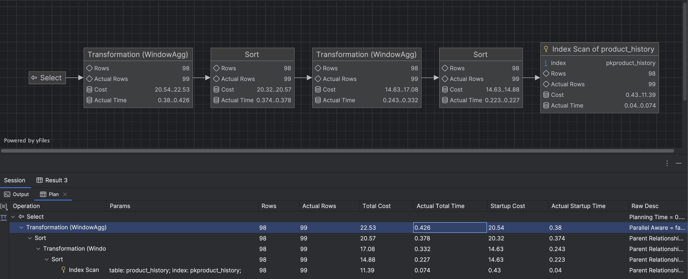
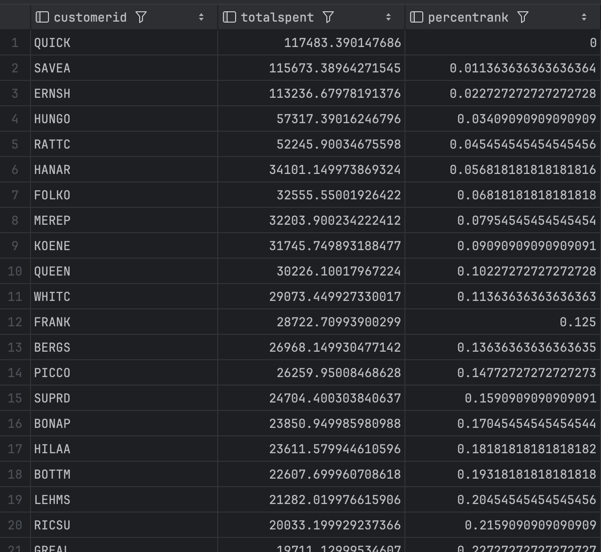

## SQL - Funkcje okna (Window functions) <br> Lab 2

---

**Imiona i nazwiska:** Michał Skałka, Jakub Płowiec

---

Celem ćwiczenia jest zapoznanie się z działaniem funkcji okna (window functions) w SQL, analiza wydajności zapytań i porównanie z rozwiązaniami przy wykorzystaniu "tradycyjnych" konstrukcji SQL

Swoje odpowiedzi wpisuj w miejsca oznaczone jako:

---

> Wyniki:

```sql
--  ...
```

---

### Ważne/wymagane są komentarze.

Zamieść kod rozwiązania oraz zrzuty ekranu pokazujące wyniki, (dołącz kod rozwiązania w formie tekstowej/źródłowej)

Zwróć uwagę na formatowanie kodu

---

## Oprogramowanie - co jest potrzebne?

Do wykonania ćwiczenia potrzebne jest następujące oprogramowanie:

- MS SQL Server - wersja 2019, 2022
- PostgreSQL - wersja 15/16/17
- SQLite
- Narzędzia do komunikacji z bazą danych
  - SSMS - Microsoft SQL Managment Studio
  - DtataGrip lub DBeaver
- Przykładowa baza Northwind/Northwind3
  - W wersji dla każdego z wymienionych serwerów

Oprogramowanie dostępne jest na przygotowanej maszynie wirtualnej

## Dokumentacja/Literatura

- Kathi Kellenberger,  Clayton Groom, Ed Pollack, Expert T-SQL Window Functions in SQL Server 2019, Apres 2019
- Itzik Ben-Gan, T-SQL Window Functions: For Data Analysis and Beyond, Microsoft 2020

- Kilka linków do materiałów które mogą być pomocne
   - [https://learn.microsoft.com/en-us/sql/t-sql/queries/select-over-clause-transact-sql?view=sql-server-ver16](https://learn.microsoft.com/en-us/sql/t-sql/queries/select-over-clause-transact-sql?view=sql-server-ver16)

  - [https://www.sqlservertutorial.net/sql-server-window-functions/](https://www.sqlservertutorial.net/sql-server-window-functions/)
  - [https://www.sqlshack.com/use-window-functions-sql-server/](https://www.sqlshack.com/use-window-functions-sql-server/)
  - [https://www.postgresql.org/docs/current/tutorial-window.html](https://www.postgresql.org/docs/current/tutorial-window.html)
  - [https://www.postgresqltutorial.com/postgresql-window-function/](https://www.postgresqltutorial.com/postgresql-window-function/)
  - [https://www.sqlite.org/windowfunctions.html](https://www.sqlite.org/windowfunctions.html)
  - [https://www.sqlitetutorial.net/sqlite-window-functions/](https://www.sqlitetutorial.net/sqlite-window-functions/)

- W razie potrzeby - opis Ikonek używanych w graficznej prezentacji planu zapytania w SSMS jest tutaj:
  - [https://docs.microsoft.com/en-us/sql/relational-databases/showplan-logical-and-physical-operators-reference](https://docs.microsoft.com/en-us/sql/relational-databases/showplan-logical-and-physical-operators-reference)

## Przygotowanie

Uruchom SSMS
- Skonfiguruj połączenie z bazą Northwind na lokalnym serwerze MS SQL

Uruchom DataGrip (lub Dbeaver)

- Skonfiguruj połączenia z bazą Northwind3
  - na lokalnym serwerze MS SQL
  - na lokalnym serwerze PostgreSQL
  - z lokalną bazą SQLite

Można też skorzystać z innych narzędzi klienckich (wg własnego uznania)

Oryginalna baza Northwind jest bardzo mała. Warto zaobserwować działanie na nieco większym zbiorze danych.

Baza Northwind3 zawiera dodatkową tabelę product_history

- 2,2 mln wierszy

Bazę Northwind3 można pobrać z moodle (zakładka - Backupy baz danych)

Można też wygenerować tabelę product_history przy pomocy skryptu

Skrypt dla SQL Srerver

Stwórz tabelę o następującej strukturze:

```sql
create table product_history(
   id int identity(1,1) not null,
   productid int,
   productname varchar(40) not null,
   supplierid int null,
   categoryid int null,
   quantityperunit varchar(20) null,
   unitprice decimal(10,2) null,
   quantity int,
   value decimal(10,2),
   date date,
 constraint pk_product_history primary key clustered
    (id asc )
)
```

Wygeneruj przykładowe dane:

Dla 30000 iteracji, tabela będzie zawierała nieco ponad 2mln wierszy (dostostu ograniczenie do możliwości swojego komputera)

Skrypt dla SQL Srerver

```sql
declare @i int
set @i = 1
while @i <= 30000
begin
    insert product_history
    select productid, ProductName, SupplierID, CategoryID,
         QuantityPerUnit,round(RAND()*unitprice + 10,2),
         cast(RAND() * productid + 10 as int), 0,
         dateadd(day, @i, '1940-01-01')
    from products
    set @i = @i + 1;
end;

update product_history
set value = unitprice * quantity
where 1=1;
```

Skrypt dla Postgresql

```sql
create table product_history(
   id int generated always as identity not null
       constraint pkproduct_history
            primary key,
   productid int,
   productname varchar(40) not null,
   supplierid int null,
   categoryid int null,
   quantityperunit varchar(20) null,
   unitprice decimal(10,2) null,
   quantity int,
   value decimal(10,2),
   date date
);
```

Wygeneruj przykładowe dane:

Skrypt dla Postgresql

```sql
do $$
begin
  for cnt in 1..30000 loop
    insert into product_history(productid, productname, supplierid,
           categoryid, quantityperunit,
           unitprice, quantity, value, date)
    select productid, productname, supplierid, categoryid,
           quantityperunit,
           round((random()*unitprice + 10)::numeric,2),
           cast(random() * productid + 10 as int), 0,
           cast('1940-01-01' as date) + cnt
    from products;
  end loop;
end; $$;

update product_history
set value = unitprice * quantity
where 1=1;
```

Wykonaj polecenia: `select count(*) from product_history`, potwierdzające wykonanie zadania

---

> Wyniki:

```sql
--  ...
```

---

# Zadanie 1

Baza: Northwind, tabela product_history

Napisz polecenie, które zwraca: id pozycji, id produktu, nazwę produktu, id_kategorii, cenę produktu, średnią cenę produktów w kategorii do której należy dany produkt. Wyświetl tylko pozycje (produkty) których cena jest większa niż średnia cena.

W przypadku długiego czasu wykonania ogranicz zbiór wynikowy do kilkuset/kilku tysięcy wierszy

pomocna może być konstrukcja `with`

```sql
with t as (

....
)
select * from t
where id between ....
```

Napisz polecenie z wykorzystaniem podzapytania, join'a oraz funkcji okna. Porównaj zapytania. Porównaj czasy oraz plany wykonania zapytań.

Przetestuj działanie w różnych SZBD (MS SQL Server, PostgreSql, SQLite)

---

> Wyniki:

```sql
--1) Subquery
SELECT *
FROM (SELECT ph.id, ph.productid, ph.productname, ph.categoryid, ph.unitprice,
 (SELECT AVG(ph2.unitprice) FROM product_history ph2 WHERE ph2.categoryid =
ph.categoryid) AS
 avg_price_category FROM product_history ph) as subquery
WHERE unitprice > avg_price_category

--2) Join
SELECT ph.id, ph.productid, ph.productname, ph. categoryid, ph.unitprice,
avg_price_category.avg
FROM product_history ph
JOIN (
 SELECT categoryid, AVG(unitprice) AS avg
 FROM product_history
 GROUP BY categoryid
) avg_price_category ON ph.categoryid = avg_price_category.categoryid
WHERE ph.unitprice > avg_price_category.avg

--3) Window function
SELECT *
FROM (SELECT ph.id, ph.productid, ph.productname, ph.categoryid, ph.unitprice, avg(unitprice) over
(partition by categoryid) as avg_price_category FROM product_history ph) as subquery
WHERE unitprice > avg_price_category
```

---

# Zadanie 2

Baza: Northwind, tabela product_history

Lekka modyfikacja poprzedniego zadania

Napisz polecenie, które zwraca: id pozycji, id produktu, datę, nazwę produktu, id_kategorii, cenę produktu oraz

- średnią cenę produktów w kategorii do której należy dany produkt.
- łączną wartość sprzedaży produktów danej kategorii (suma dla pola value)
- średnią cenę danego produktu w roku którego dotyczy dana pozycja
- łączną wartość sprzedaży produktu w roku którego dotyczy dana pozycja (suma dla pola value)

Napisz polecenie z wykorzystaniem podzapytania, join'a oraz funkcji okna. Porównaj zapytania. W przypadku funkcji okna spróbuj użyć klauzuli WINDOW.

Podobnie jak poprzednio, w przypadku długiego czasu wykonania ogranicz zbiór wynikowy do kilkuset/kilku tysięcy wierszy

Porównaj czasy oraz plany wykonania zapytań.

Przetestuj działanie w różnych SZBD (MS SQL Server, PostgreSql, SQLite)

---

#### Podzapytania

> Wyniki:

```sql
SELECT
    phist.id,
    phist.productid,
    phist.date,
    phist.productname,
    phist.categoryid,
    phist.unitprice,

    -- Średnia cena produktów w kategorii
    (SELECT AVG(phist2.unitprice)
     FROM product_history phist2
     WHERE phist2.categoryid = phist.categoryid AND phist2.id < 100) AS avg_category_price,

    -- Łączna wartość sprzedaży produktów w danej kategorii
    (SELECT SUM(phist3.unitprice)
     FROM product_history phist3
     WHERE phist3.categoryid = phist.categoryid AND phist3.id < 100) AS total_category_sales,

    -- Średnia cena danego produktu w roku, którego dotyczy dana pozycja
    (SELECT AVG(phist4.unitprice)
     FROM product_history phist4
     WHERE phist4.productid = phist.productid
       AND YEAR(phist4.date) = YEAR(phist.date) AND phist4.id < 100) AS avg_product_price_year,

    -- Łączna wartość sprzedaży produktu w roku, którego dotyczy dana pozycja
    (SELECT SUM(phist5.unitprice)
     FROM product_history phist5
     WHERE phist5.productid = phist.productid
       AND YEAR(phist5.date) = YEAR(phist.date) AND phist5.id < 100) AS total_product_sales_year


FROM product_history as phist WHERE id < 100
```

#### JOIN

```sql
SELECT
    ph.id,
    ph.productid,
    ph.date,
    ph.productname,
    ph.categoryid,
    ph.unitprice,

    AVG(ph2.unitprice) AS avg_category_price,
    SUM(ph2.unitprice) AS total_category_sales,
    AVG(ph3.unitprice) AS avg_product_price_year,
    SUM(ph3.unitprice) AS total_product_sales_year

FROM product_history ph
JOIN product_history ph2 ON ph2.categoryid = ph.categoryid AND ph2.id < 100
JOIN product_history ph3 ON ph3.productid = ph.productid AND ph3.id < 100
    AND YEAR(ph3.date) = YEAR(ph.date)
WHERE ph.id < 100
GROUP BY ph.id, ph.productid, ph.date, ph.productname, ph.categoryid, ph.unitprice;
```

#### Funkcja okna

```sql
SELECT
    ph.id,
    ph.productid,
    ph.date,
    ph.productname,
    ph.categoryid,
    ph.unitprice,

    AVG(ph.unitprice) OVER (PARTITION BY ph.categoryid) AS srednia_cena_w_kategorii,
    SUM(ph.unitprice) OVER (PARTITION BY ph.categoryid) AS laczna_wartosc_kategorii,
    AVG(ph.unitprice) OVER (PARTITION BY ph.productid, YEAR(ph.date)) AS srednia_cena_produktu_w_roku,
    SUM(ph.unitprice) OVER (PARTITION BY ph.productid, YEAR(ph.date)) AS laczna_wartosc_produktu_w_roku

FROM product_history ph
WHERE ph.id < 100
```

---

#### MS SQL

a. podzapytania

execution: 17 ms, fetching: 150 ms


b. JOINy

execution: 22 ms, fetching: 112 ms


c. Funkcja okna

execution: 9 ms, fetching: 203 ms


---

#### PostgreSQL

a. podzapytania

execution: 17 ms, fetching: 242 ms


b. JOINy

execution: 7 ms, fetching: 76 ms


c. Funkcja okna

execution: 6 ms, fetching: 91 ms



---

#### SQL Lite

a. podzapytania

execution: 263 ms, fetching: 23 s 140 ms


b. JOINy

`[2025-03-23 16:24:56] Database returned plan in unsupported format: unexpected PARTIAL != INDEX`

execution: 191 ms, fetching: 272 ms


c. Funkcja okna

execution: 82 ms, fetching: 151 ms


---

# Zadanie 3

Funkcje rankingu, `row_number()`, `rank()`, `dense_rank()`

Wykonaj polecenie, zaobserwuj wynik. Porównaj funkcje row_number(), rank(), dense_rank(). Skomentuj wyniki.

```sql
select productid, productname, unitprice, categoryid,
    row_number() over(partition by categoryid order by unitprice desc) as rowno,
    rank() over(partition by categoryid order by unitprice desc) as rankprice,
    dense_rank() over(partition by categoryid order by unitprice desc) as denserankprice
from products;
```

---

> Wyniki:


a. row_number()

Przypisuje unikalny numer dla każdego rekordu na podstawie ustalonego sortowania danych za pomocą _order by_. W tym przypadku wartości _unitprice_ są posortowane malejąco, a zatem wartości w kolumnie _rowno_ są numerowane w tej kolejności poczynając od wartości 1. W przypadku wystąpienia identycznych wartości w kolumnie _unitprice_, nadanie zostanie mimo wszystko kolejny unikatowy identyfikator.

b. rank()

Przypisuje numery bardzo podobnie do _row_number()_, a jedyną różnicą jest fakt, iż te wartości (rangi) mogą się powtarzać. Zachodzi to w przypadku, gdy wartości w kolumnie _unitprice_ są identyczne w stosunku do poprzednich rekordów. 'Zduplikowanie' owych rang, powoduje że kolejna napotkana wartość _unitprice_, która jest unikalna - nie otrzyma kolejnej rangi + 1, a nastąpi 'przeskok' w numeracji.

c. dense_rank()

Przypisuje numery łącząc cechy zarówno funkcji _row_number()_ jak i _rank()_. Wartości zduplikowane otrzymają te samą rangę, natomiast nie następuje już 'przeskok' po wystąpieniu powtarzających się wartości - a zawsze jest ranga inkrementowana o 1.

---

Zadanie

Spróbuj uzyskać ten sam wynik bez użycia funkcji okna

---

> Wyniki:

```sql
SELECT p1.productid,
       p1.productname,
       p1.unitprice,
       p1.categoryid,

       -- row_number()
       (SELECT COUNT(*)
        FROM products p2
        WHERE p2.categoryid = p1.categoryid
          AND p2.unitprice > p1.unitprice) + 1 AS rowno,

       -- rank()
       (SELECT COUNT(DISTINCT p2.unitprice)
        FROM products p2
        WHERE p2.categoryid = p1.categoryid
          AND p2.unitprice > p1.unitprice) + 1 AS rankprice,

       -- dense_rank()
       (SELECT COUNT(DISTINCT p2.unitprice)
        FROM products p2
        WHERE p2.categoryid = p1.categoryid
          AND p2.unitprice >= p1.unitprice) AS denserankprice

FROM products p1
ORDER BY p1.categoryid, p1.unitprice DESC;
```

---

# Zadanie 4

Baza: Northwind, tabela product_history

Dla każdego produktu, podaj 4 najwyższe ceny tego produktu w danym roku. Zbiór wynikowy powinien zawierać:

- rok
- id produktu
- nazwę produktu
- cenę
- datę (datę uzyskania przez produkt takiej ceny)
- pozycję w rankingu

Uporządkuj wynik wg roku, nr produktu, pozycji w rankingu

---

> Wyniki:

```sql
WITH ProductPriceRanking AS (
    SELECT
        YEAR(p.date) AS year,
        p.productid,
        p.productname,
        p.unitprice,
        p.date,
        DENSE_RANK() OVER (
            PARTITION BY YEAR(date), p.productid
            ORDER BY p.unitprice DESC
        ) AS priceRank
    FROM product_history p
)
SELECT *
FROM ProductPriceRanking
WHERE priceRank <= 4
ORDER BY
    year,
    productid,
    priceRank;
```


---

1. MS SQL

execution: 369 ms, fetching: 311 ms


2. PostfreSQL

execution: 2 s 437 ms, fetching: 226 ms


3. SQLite

execution: 3 s 465 ms, fetching: 180 ms


---

Spróbuj uzyskać ten sam wynik bez użycia funkcji okna, porównaj wyniki, czasy i plany zapytań. Przetestuj działanie w różnych SZBD (MS SQL Server, PostgreSql, SQLite)

---

> Wyniki:

```sql
WITH ProductPriceRanking AS (
  SELECT YEAR(ph.date) as year,
        ph.productid,
        ph.productname,
        ph.unitprice,
        ph.date,
        (
          SELECT count(DISTINCT ph2.unitprice) + 1
          FROM product_history ph2
          WHERE ph.productid = ph2.productid
            AND YEAR(ph.date) = YEAR(ph2.date)
            AND ph2.unitprice > ph.unitprice) AS priceRank
  FROM product_history ph
)
SELECT * FROM ProductPriceRanking
WHERE priceRank <= 4
ORDER BY
    year,
    productid,
    priceRank;
```

Zapytanie wykonuje się w nieksończoność, ponad 12 min i dalej trwa...

Zatem do rozwiązania tego problemu najbardziej nadaje się funckja okna `DENSE_RANK`. Która w porównaniu do innych podjeść działa w kończonym i szybkim czasie. Najszybciej działa ona w MS SQL, a potem w PostreSQL. Najdłużej wykonuje się w SQLite. Wykresy wykonania są całkiem podobne w MSSQL i PostgreSQL. Ten z SQLite różni się i ma rozgałęzienia.

---

# Zadanie 5

Funkcje `lag()`, `lead()`

Wykonaj polecenia, zaobserwuj wynik. Jak działają funkcje `lag()`, `lead()`

```sql
select productid, productname, categoryid, date, unitprice,
       lag(unitprice) over (partition by productid order by date)
as previousprodprice,
       lead(unitprice) over (partition by productid order by date)
as nextprodprice
from product_history
where productid = 1 and year(date) = 2022
order by date;

with t as (select productid, productname, categoryid, date, unitprice,
                  lag(unitprice) over (partition by productid
order by date) as previousprodprice,
                  lead(unitprice) over (partition by productid
order by date) as nextprodprice
           from product_history
           )
select * from t
where productid = 1 and year(date) = 2022
order by date;
```

---

> Wyniki:


a. _lag()_

Pobiera wartość z poprzedniego wiersza

b. _lead()_

Pobiera wartość z następnego wiersza

---

Zadanie

Spróbuj uzyskać ten sam wynik bez użycia funkcji okna, porównaj wyniki, czasy i plany zapytań. Przetestuj działanie w różnych SZBD (MS SQL Server, PostgreSql, SQLite)

---

> Wyniki:

```sql
--  ...
```

---

# Zadanie 6

Baza: Northwind, tabele customers, orders, order details

Napisz polecenie które wyświetla inf. o zamówieniach

Zbiór wynikowy powinien zawierać:

- nazwę klienta, nr zamówienia,
- datę zamówienia,
- wartość zamówienia (wraz z opłatą za przesyłkę),
- nr poprzedniego zamówienia danego klienta,
- datę poprzedniego zamówienia danego klienta,
- wartość poprzedniego zamówienia danego klienta.

---

> Wyniki:

```sql
--  ...
```

---

# Zadanie 7

Funkcje `first_value()`, `last_value()`

Baza: Northwind, tabele customers, orders, order details

Wykonaj polecenia, zaobserwuj wynik. Jak działają funkcje `first_value()`, `last_value()`. Skomentuj uzyskane wyniki. Czy funkcja `first_value` pokazuje w tym przypadku najdroższy produkt w danej kategorii, czy funkcja `last_value()` pokazuje najtańszy produkt? Co jest przyczyną takiego działania funkcji `last_value`. Co trzeba zmienić żeby funkcja last_value pokazywała najtańszy produkt w danej kategorii

```sql
select productid, productname, unitprice, categoryid,
    first_value(productname) over (partition by categoryid
order by unitprice desc) first,
    last_value(productname) over (partition by categoryid
order by unitprice desc) last
from products
order by categoryid, unitprice desc;
```

## 

> Wyniki:

```sql
select productid, productname, unitprice, categoryid,
    first_value(productname) over (partition by categoryid
order by unitprice desc) first,
    last_value(productname) over (partition by categoryid
order by unitprice desc
ROWS BETWEEN UNBOUNDED PRECEDING AND UNBOUNDED FOLLOWING) last -- <-
from products
order by categoryid, unitprice desc;
```


Funkcja `first_value()` zwraca pierwszy wiersz z zakresu, a `last_value()` ostatni. Analizując uzyskane wyniki widzimy, ze `first_value()` działa poprawnie - bierze pierwszy wiersz w ramach partycji posortowanej malejąco. Problem pojawia się przy `last_value()`, które nie działa jak powinno i nie zwraca najnizszej ceny. Przyczyną jest domyślny zakres okna (current row).

W przypadku `first_value()` mamy oczekiwany wynik, bo jego domyślny zakres zatrzymuje się na bieżącym wierszu. Dla sortowania malejącego (DESC) pierwszy wiersz to zawsze najwyższa wartość. Zakres UNBOUNDED PRECEDING AND CURRENT ROW gwarantuje jej wybór.

`last_value()` zatrzymuje się na bieżącym wierszu i nie obejmuje całego zakresu partycji, przez co wybiera nieprzewidywalną wartość.

---

Zadanie

Spróbuj uzyskać ten sam wynik bez użycia funkcji okna, porównaj wyniki, czasy i plany zapytań. Przetestuj działanie w różnych SZBD (MS SQL Server, PostgreSql, SQLite)

---

> Wyniki:

```sql
WITH MaxMinPrices AS (
    SELECT
        CategoryID,
        MAX(UnitPrice) AS MaxPrice,
        MIN(UnitPrice) AS MinPrice
    FROM
        Products
    GROUP BY
        CategoryID
)
SELECT
    ph.ProductID,
    ph.ProductName,
    ph.UnitPrice,
    ph.CategoryID,
    (
        SELECT ProductName
        FROM Products ph2
        WHERE ph2.CategoryID = ph.CategoryID
          AND ph2.UnitPrice = mm.MaxPrice
    ) AS NajdrozszyProdukt,
    (
        SELECT ProductName
        FROM Products ph2
        WHERE ph2.CategoryID = ph.CategoryID
          AND ph2.UnitPrice = mm.MinPrice
    ) AS NajtanszyyProdukt
FROM
    Products ph
JOIN
    MaxMinPrices mm ON ph.CategoryID = mm.CategoryID
ORDER BY
    ph.CategoryID,
    ph.UnitPrice DESC;
```

1. MS SQL

execution: 10 ms, fetching: 227 ms


execution: 11 ms, fetching: 356 ms


W MS SQL wyniki funkcji okna i zapytania bez nich z są bardzo podobne (z drobną przewagą funkcji okna). Graf zapytania jest mniej skomplikowany dla funkcji okna.

2. PostgreSQL

execution: 4 ms, fetching: 292 ms


execution: 6 ms, fetching: 265 ms


Czasy lepsze od MS SQL. Graf jest znacząco prostrszy dla funkcji okna. Zapytanie bez niej jest lekko wolniejsze.

3. SQLite

execution: 8 ms, fetching: 294 ms


execution: 7 ms, fetching: 297 ms


W SQLite apytania wykonują się praktycznie w tym samym czasie. Funkcja okna ma nieco prostrszy graf

Zapytanie wykonuje się najszybciej na SQLite i PostgreSQL. Najwolniej na MS SQL.

---

# Zadanie 8

Baza: Northwind, tabele orders, order details

Napisz polecenie które wyświetla inf. o zamówieniach

Zbiór wynikowy powinien zawierać:

- Id klienta,
- nr zamówienia,
- datę zamówienia,
- wartość zamówienia (wraz z opłatą za przesyłkę),
- dane zamówienia klienta o najniższej wartości w danym miesiącu
  - nr zamówienia o najniższej wartości w danym miesiącu
  - datę tego zamówienia
  - wartość tego zamówienia
- dane zamówienia klienta o najwyższej wartości w danym miesiącu
  - nr zamówienia o najniższej wartości w danym miesiącu
  - datę tego zamówienia
  - wartość tego zamówienia

---

> Wyniki:

```sql
WITH OrderValues AS (
    select o.customerid,
            o.orderid,
            o.orderdate,
            SUM(od.UnitPrice * od.Quantity * (1 - od.Discount)) + o.Freight AS totalOrderValue,
            EXTRACT(YEAR FROM o.orderdate) as orderYear,
            EXTRACT(MONTH FROM o.orderdate) as orderMonth
    from orders o
              join public.orderdetails od on o.orderid = od.orderid
    group by o.customerid, o.orderid, o.orderdate, o.Freight
)
SELECT
    customerid,
    orderid,
    orderdate,
    totalOrderValue,

    FIRST_VALUE(OrderID) OVER (
            PARTITION BY customerID, orderYear, orderMonth
            ORDER BY totalOrderValue ASC
    ) AS MinOrderID,
    FIRST_VALUE(orderdate) OVER (
            PARTITION BY customerID, orderYear, orderMonth
            ORDER BY totalOrderValue ASC
    ) AS MinOrderID,
    FIRST_VALUE(totalOrderValue) OVER (
            PARTITION BY customerID, orderYear, orderMonth
            ORDER BY totalOrderValue ASC
    ) AS MinOrderID,

    FIRST_VALUE(OrderID) OVER (
            PARTITION BY customerID, orderYear, orderMonth
            ORDER BY totalOrderValue DESC
    ) AS MinOrderID,
    FIRST_VALUE(orderdate) OVER (
            PARTITION BY customerID, orderYear, orderMonth
            ORDER BY totalOrderValue DESC
    ) AS MinOrderID,
    FIRST_VALUE(totalOrderValue) OVER (
            PARTITION BY customerID, orderYear, orderMonth
            ORDER BY totalOrderValue DESC
    ) AS MinOrderID
FROM OrderValues
```


Bazując na przykładzie z poprzedniego zadania, budujemy powyzsze zapytanie które zwraca zadane wartości. Używamy do tego `FIRST_VALUE` z odpowiednim sortowaniem (co zastępuje nam użycie `LAST_VALUE`)

---

# Zadanie 9

Baza: Northwind, tabela product_history

Napisz polecenie które pokaże wartość sprzedaży każdego produktu narastająco od początku każdego miesiąca. Użyj funkcji okna

Zbiór wynikowy powinien zawierać:

- id pozycji
- id produktu
- datę
- wartość sprzedaży produktu w danym dniu
- wartość sprzedaży produktu narastające od początku miesiąca

W przypadku długiego czasu wykonania ogranicz zbiór wynikowy do kilkuset/kilku tysięcy wierszy

```sql
-- wyniki ...
```

Spróbuj wykonać zadanie bez użycia funkcji okna. Spróbuj uzyskać ten sam wynik bez użycia funkcji okna, porównaj wyniki, czasy i plany zapytań. Przetestuj działanie w różnych SZBD (MS SQL Server, PostgreSql, SQLite)

---

> Wyniki:

```sql
--  ...
```

---

# Zadanie 10

Wykonaj kilka "własnych" przykładowych analiz. Czy są jeszcze jakieś ciekawe/przydatne funkcje okna (z których nie korzystałeś w ćwiczeniu)? Spróbuj ich użyć w zaprezentowanych przykładach.

---

> Wyniki:

1. #### `NTILE` - Dzieli wyniki na n równych przedziałów<br>

   Podzielmy klientów na 4 grupy (kwarty) w zależności od wartości, jaką wydali na zamówienia w ciągu całego roku. Każdy klient zostanie przypisany do jednej z grup na podstawie sumy wydanych pieniędzy.

```sql
WITH CustomerSales AS (
    SELECT
        o.customerid,
        SUM(od.unitprice * od.quantity) AS totalSpent
    FROM orderdetails od
    JOIN Orders o ON od.orderid = o.orderid
    GROUP BY o.customerid
),
Quartiles AS (
    SELECT
        customerid,
        TotalSpent,
        NTILE(4) OVER (ORDER BY TotalSpent DESC) AS spendingQuartile
    FROM CustomerSales
)
SELECT
    q.customerid,
    q.totalSpent,
    q.spendingQuartile,
    MIN(q.TotalSpent) OVER (PARTITION BY q.spendingQuartile) AS minInQuartile,
    MAX(q.TotalSpent) OVER (PARTITION BY q.spendingQuartile) AS maxInQuartile
FROM Quartiles q;
```


2. #### `CUME_DIST` - Skumulowana dystrybucja (procent wartości ≤ danej wartości)

Obliczmy procentową dystrybucję klientów na podstawie sumy wydanych pieniędzy w zamówieniach. Dla każdego klienta będziemy wyświetlać, jaką część wszystkich klientów stanowią ci, którzy wydali mniej lub równiej niż oni.

```sql
WITH CustomerOrders AS (
    SELECT
        o.customerid,
        SUM(od.unitPrice * od.quantity) AS totalSpent
    FROM orderdetails od
    JOIN Orders o ON od.orderid = o.orderid
    GROUP BY o.customerid
)
SELECT
    customerid,
    totalSpent,
    PERCENT_RANK() OVER (ORDER BY totalSpent DESC) AS percentRank
FROM CustomerOrders;
```



3. Porównanie miesięcznej sprzedaży do średniej ruchomej

```sql
WITH MonthlySales AS (
    SELECT
        TO_CHAR(o.OrderDate, 'YYYY-MM') AS OrderMonth,
        SUM(od.UnitPrice * od.Quantity) AS TotalSales
    FROM orderdetails od
    JOIN Orders o ON od.OrderID = o.OrderID
    GROUP BY TO_CHAR(o.OrderDate, 'YYYY-MM')
)
SELECT
    OrderMonth,
    TotalSales,
    AVG(TotalSales) OVER (ORDER BY OrderMonth ROWS
     BETWEEN 2 PRECEDING AND CURRENT ROW) AS RollingAvgSales
FROM MonthlySales;
```


---

Punktacja

|         |     |
| ------- | --- |
| zadanie | pkt |
| 1       | 2   |
| 2       | 2   |
| 3       | 2   |
| 4       | 2   |
| 5       | 2   |
| 6       | 2   |
| 7       | 2   |
| 8       | 2   |
| 9       | 2   |
| 10      | 2   |
| razem   | 20  |
